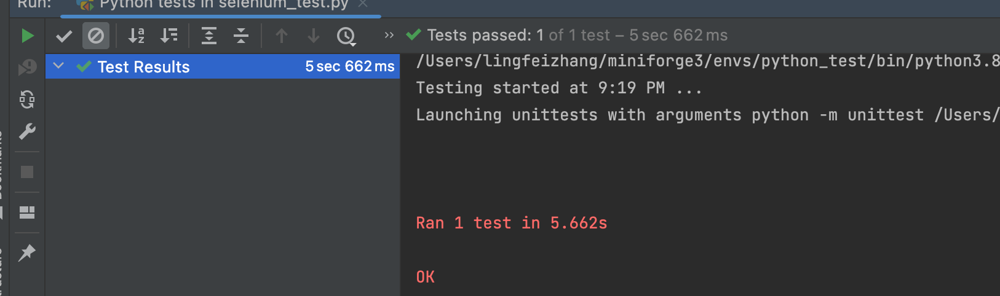
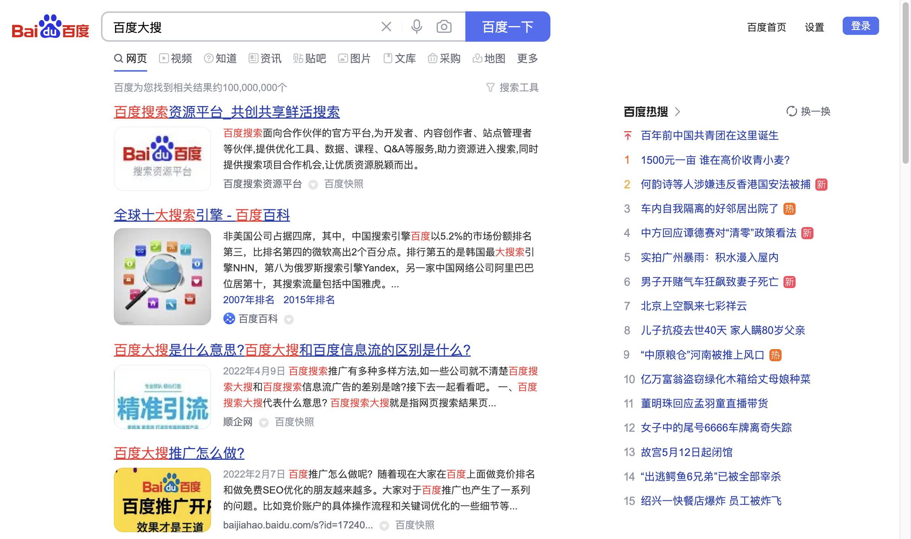

# 这句可以让网页链接图片显示
<meta name="referrer" content="no-referrer"/>

# Python+Selenium+Unitest

> 自动化ui测试。yysy，具体工作中ui-test还得靠万能的人类
## Selenium
  
```python
    conda install selenium #我是在conda虚拟环境里，正常pip install selenium即可  
```
1. Selenium2和3抛弃了SeleniumRC，使用WebDriver。

2. Webdriver不依赖于任何测试框架，除了必要的浏览器驱动，无需启动其他进程，也不必像Selenium 1那样需要先启动服务；

3. Server-Client经典设计模式

    > Server端：可以是任意的浏览器，当脚本启动浏览器时，该浏览器就是Server，它的职责是处理Client发送的请求并做出响应；

   >Client端：即我们的测试代码，测试代码发送HTTP请求给Server（即浏览器），Server接受请求，执行相应操作并返回结果；

  4. 不同的浏览器，WebDriver需要依赖对应的浏览器驱动（如chromedriver.exe）来转化浏览器的native调用，所以进行Selenium自动化时，需先下载对应的浏览器的驱动。

## Unitest
  
  unittest 是python 的单元测试框架，unittest 单元测试提供了创建测试用例，测试套件以及批量执行的方案， unittest 在安装pyhton 以后就直接自带了，直接import unittest 就可以使用。

  作为单元测试的框架， unittest 也是可以对程序最小模块的一种敏捷化的测试。在自动化测试中，必须需要知道所使用语言的单元测试框架。利用单元测试框架，创建一个类，该类继承unittest的TestCase，这样可以把每个case看成是一个最小的单元， 由测试容器组织起来，到时候直接执行，同时引入测试报告。


## Demo
> 实现自动测试百度搜索某关键词的测试用例，并保存截图。
### chromedriver安装
    选择与自己chrome版本对应的chromedriver版本
    如我的版本为：
  
   找到chromedriver版本对应下载，保持大版本一致即可。
  
  下载解压后将chromedriver放入/usr/bin。
  
  Done.

### 测试代码
```python
# coding=utf-8
from selenium import webdriver
import time
import unittest
# 单元测试框架，使用该模块，我们可以对用例进行组织和运行
# 例如如下的BaiduTestCase类继承unittest.TestCase,该类执行会把test开头的方法当成一个测试用例去执行

class BaiduTestCase(unittest.TestCase):
    def setUp(self):
        print('='*10+"start test demo"+'='*10)
        url = 'https://www.baidu.com'
        self.driver = webdriver.Chrome()  # 选择谷歌浏览器
        self.driver.get(url)  # 打开百度页面

    def test_bubutton(self):
        self.driver.find_element_by_id('kw').clear()
        self.driver.find_element_by_id('kw').send_keys('百度大搜')  # 搜索框输入内容
        self.driver.find_element_by_id('su').click()  # 点击百度按钮
        time.sleep(3)
        self.driver.save_screenshot('baidu.png')  # 截图

    def tearDown(self):
        print('='*10+"test demo finished"+'='*10)
        self.driver.quit()  # 退出浏览器


if __name__ == '__main__':
    # unittest.main()
    # 执行单个用例
    baidu = BaiduTestCase()
    baidu()

```
### 运行结果

成功执行百度搜索，自动打开chrome,搜索“百度大搜”的界面。


### 备注
> 注意： 测试用例的命名一般是 def test_xxx（），只有用test_xxx命名，编译器才会自动识别并执行测试用例。
- unittest.main 

  意思是搜索该模块下所有以test开头的测试用例方法，并自动执行它们。


